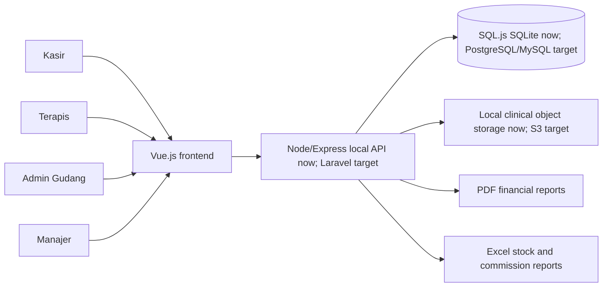

# Architecture

Source evidence: `C:\Users\stefa\Downloads\Rancangan Sistem Informasi Klinik Kecantikan.pdf`

Evidence status: this workspace now contains a Vue frontend plus a local Node/Express real-services backend under `prototype/`. Auth, persistence, POS finalization, FIFO mutation, local clinical object storage, and PDF/XLSX export run locally. Laravel, PostgreSQL/MySQL production hosting, external S3, WhatsApp, and payroll governance remain target design.

## System Summary

SIM-KK is designed as a clinic management system with separated presentation, business logic, and data persistence. The current implementation is a Vue 3 frontend connected to a local Node/Express API with SQL.js SQLite persistence. The DPPL still recommends Laravel for the final backend, PostgreSQL or MySQL for relational data, and S3-compatible storage for before/after clinical photos.

Main domains: authentication and role access, patient medical records, POS transactions and receipts, therapist commission snapshots, inventory/FIFO, and reports.

## Tech Stack

Implemented stack: Vue 3, TypeScript, Vite, CSS tokens, Lucide icons, Express, SQL.js SQLite, PDFKit, ExcelJS, Node API tests, and Playwright smoke tests.

Source-backed target stack still pending for production hardening: Laravel/PHP backend, PostgreSQL or MySQL database, external S3-compatible object storage, WhatsApp integration, deployment, backup, and audit policy.

Current workspace state: working local full-stack slice exists under `prototype/`; no Laravel app, production DB migrations, external object-storage runtime config, or production deployment config exists. Project root is not a git repository.

## Repository Structure

Observed:

```text
C:\Users\stefa\Project\SIM-KK\
  .omx\
  docs\superpowers\
  outputs\sim-kk-screenshots\
  prototype\
    backend\
    data\           # runtime SQLite file, ignored
    storage\        # runtime local clinical objects, ignored
  CONTEXT.md
  ARCHITECTURE.md
```

Expected backend structure is unknown. If the recommended stack is used, the repo may later add a Laravel app alongside or behind the current Vue prototype.

## Frontend Architecture

Verified from PDF:
- Presentation/boundary layer is separated from backend business logic.
- POS dashboard is optimized for fast cashier operation.
- POS layout: service/product tiles on the left, billing cart on the right.
- POS includes direct therapist selection to lock commission ownership.
- Medical record UI is tablet-friendly for treatment-room use.
- Before/after upload supports drag-and-drop or direct capture.

Implemented:
- `prototype/src/App.vue` controls demo login, role state, and module switching.
- `prototype/src/services/api.ts` calls the backend API.
- `prototype/src/views/PosView.vue` implements POS catalog, patient context, therapist selection, cart, and real `Lunas` finalization.
- `prototype/src/views/MedicalRecordView.vue` implements patient record, timeline, local object references, and real note/photo save actions.
- `prototype/src/views/InventoryView.vue` implements stock table, FIFO batch visualization, and real supplier purchase save.
- `prototype/src/views/ReportsView.vue` implements PDF/Excel preview and real file download.

Unknown: production router, deeper form validation approach, offline behavior, and tablet device policy.

## Backend Architecture

Current local backend:
- `prototype/backend/server.mjs` starts the API on `127.0.0.1:5174`.
- `prototype/backend/app.mjs` defines Express routes and auth middleware.
- `prototype/backend/database.mjs` owns SQL.js schema, seed data, persistence, business rules, report rows, and FIFO mutation.
- `prototype/backend/reporting.mjs` generates PDF and XLSX buffers.
- `prototype/backend/storage.mjs` stores clinical photo payloads under local object-storage-style paths.

Source-backed production target:
- Laravel is still the recommended final backend framework.
- Backend owns business logic and data access.
- Login accepts username/password and distinguishes access by role.
- Medical record logic handles complaints, actions, treatment history, and clinical photo upload integration.
- POS logic records products/services, therapist assignment, payment status, receipts, cash ledger, and commission snapshots.
- Inventory logic records supplier purchases, HPP, and FIFO mutation.

Important modules:
- Auth / role access.
- Users and Pasien.
- Rekam Medis and clinical photo references.
- Transaksi and Transaksi Detail.
- Produk/Layanan.
- Therapist commission.
- Inventaris and supplier purchases.
- Reports and storage integration.

Unknown for production: exact Laravel auth package, route style, queues, upload validation, audit logging, authorization middleware, and cloud storage provider.

## Database Design

Source-backed entities and fields:

### Users

```text
id_pengguna: integer, primary key, auto increment
username: varchar(20)
password: varchar(255), hashed/encrypted
nama_lengkap: varchar(50)
level: varchar(15), role such as Kasir/Admin/Gudang/Terapis
```

### Pasien

```text
id_pasien: integer, primary key, auto increment
nama_pasien: varchar(50)
usia: integer(3)
alamat: varchar(100)
nomor_telp: varchar(15), intended for WhatsApp integration
rekam_medis_id: varchar(20), unique medical record identifier
```

### Transaksi Detail

```text
id_detail: integer, primary key, auto increment
id_transaksi: integer, foreign key to transaction parent
id_produk: integer, foreign key to service/product
id_terapis: integer, foreign key
nilai_komisi: integer, permanent commission snapshot
```

Additional tables required but not specified in detail: Transaksi, Produk/Layanan, Rekam Medis, Foto Klinis/media references, Inventaris/stock batches, Supplier purchases, and cash ledger.

## API Flow

Current local API routes:

1. `POST /api/login` verifies username/password/role and creates a bearer session token.
2. `GET /api/bootstrap` returns users, patients, services, therapists, transactions, inventory, and reports.
3. `POST /api/transactions/pay` creates a `Lunas` transaction, immutable commission snapshot, receipt ID, cash ledger entry, and FIFO stock decrement.
4. `POST /api/patients/:patientId/treatments` saves chronological treatment notes.
5. `POST /api/patients/:patientId/photos` stores a local clinical object and saves its object reference.
6. `POST /api/inventory/purchases` saves supplier batch purchases and refreshes FIFO order.
7. `GET /api/reports/:reportId/export` returns a real PDF or XLSX file.

## Authentication And Authorization

Verified:
- Login uses username and password.
- Password should be hashed/encrypted.
- Roles include Kasir, Terapis, Gudang/Admin, and Manajer.

Implemented locally:
- Passwords are hashed with Node `scryptSync` in seed/runtime.
- Login returns bearer tokens stored in the local SQLite sessions table.
- API routes require bearer auth.

Unknown for production: password reset, patient login, 2FA, permission granularity beyond role names, session expiry, and audit review policy.

## Key Dependencies

Target dependencies by purpose:
- Laravel: backend framework, business logic, data access.
- Vue.js: interactive frontend/POS interface.
- PostgreSQL or MySQL: relational database.
- S3-compatible storage: before/after clinical photos.
- PDF generator: financial reports.
- Excel generator: stock and commission exports.

Dependencies are listed in `prototype/package.json`. Important backend packages: `express`, `sql.js`, `pdfkit`, and `exceljs`.

## System Diagram



## Runtime And Deployment

Local runtime:
- `npm run dev` starts API and Vite together.
- API listens on `127.0.0.1:5174`.
- Vite listens on `127.0.0.1:5173` and proxies `/api` to the backend.
- Runtime SQLite is `prototype/data/simkk.sqlite`.
- Runtime clinical files are under `prototype/storage/clinical`.

Unknown for production: hosting provider, production runtime, web server, database host, external object storage provider, CI/CD, backup and restore policy.

Expected environment variables by purpose:
- Database connection.
- App secret/session key.
- S3 endpoint/bucket/access credentials.
- Report/storage paths.
- WhatsApp integration credentials if implemented.

Do not store secret values in documentation or source control.

## Important Technical Constraints

- Keep frontend presentation separate from backend business logic and database access.
- Store photo references/metadata in the relational database if using S3 object storage. Current local adapter stores object references in SQL.js and files under `prototype/storage/clinical`.
- Commission snapshots must be immutable or carefully audited after transaction approval.
- FIFO requires stock batch data to determine cost and sell/use order.
- PDF and Excel reports must be generated from approved database records.
- Medical photo handling needs privacy, access control, retention, and audit-trail decisions before implementation.

## Unknowns

- Final Laravel repo shape, production database engine, deployment target, and backup policy.
- Cloud S3 provider, WhatsApp scope, and clinical data privacy requirements.
- Production commission approval/audit rules beyond the current immutable snapshot behavior.
